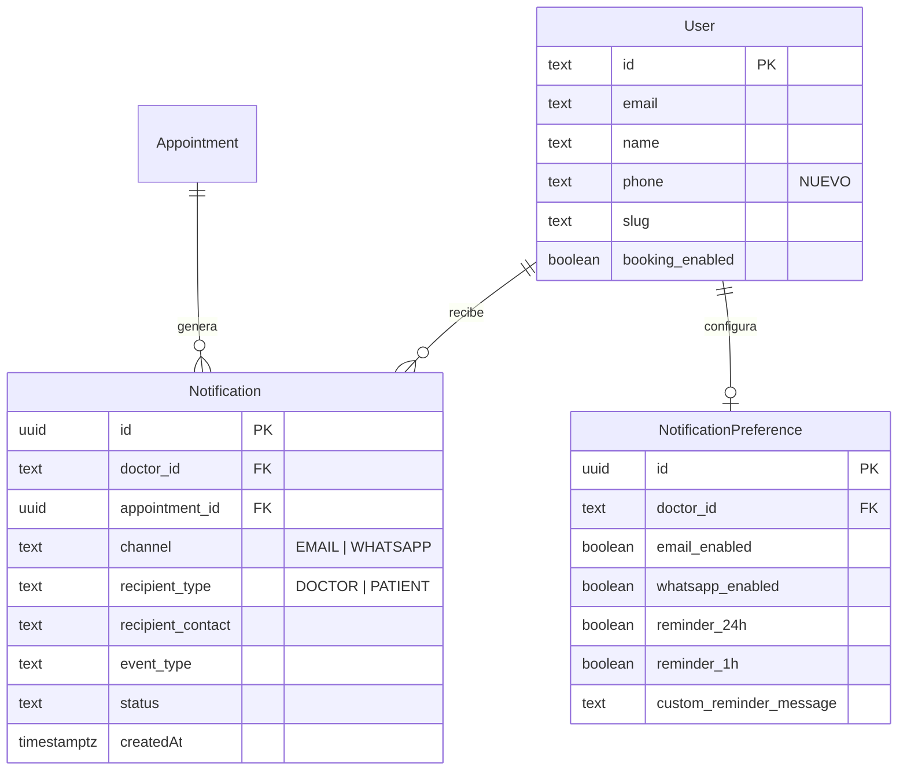

# Sistema de Notificaciones — WhatsApp & Email para Cognify

## Descripción del Problema

Actualmente Cognify tiene un sistema de reservas funcional donde pacientes pueden agendar citas con psicólogos a través de `/book/[slug]`. Sin embargo, **no existe ningún sistema de notificaciones real**. Los flujos de aprobación/rechazo solo tienen `console.log()` como placeholder. Esto significa:

- El psicólogo **no se entera** cuando un paciente reserva una cita
- El paciente **nunca recibe confirmación** cuando su cita es aprobada o rechazada
- No hay **recordatorios automáticos** para citas próximas
- La pantalla de éxito dice "Te notificaremos pronto" pero **no notifica nada**

Este plan implementa un sistema completo de notificaciones vía **WhatsApp** (usando Twilio) y **Email** (usando Resend).

---

## Estado Actual del Código

### Stack Tecnológico
- **Frontend**: Next.js 16.1.6 + React 19 + Tailwind v4
- **Backend**: Next.js API Routes + Supabase (Auth + PostgreSQL)
- **Validación**: Zod v4
- **Timezone**: Hardcoded `America/Caracas`

### Flujo de Reserva Actual
1. Paciente busca doctor en `/book` → selecciona en `/book/[slug]`
2. Wizard de 3 pasos: Fecha/Hora → Datos del Paciente → Instrucciones de Pago
3. POST a `/api/booking/[slug]/request` → crea `Appointment` con `status=PENDING_APPROVAL`
4. Doctor ve en su dashboard → aprueba o rechaza vía `PATCH /api/appointments/[id]`

### Gaps Críticos Identificados

| Gap | Impacto | Solución Propuesta |
|-----|---------|-------------------|
| **No hay campo de email** en el formulario de reserva | No se puede notificar al paciente por email | Añadir campo `email` al formulario de booking |
| **No hay email del doctor** accesible en el booking flow | No se puede notificar al doctor cuando recibe reserva | El email del doctor ya está en la tabla `User` |
| **No hay teléfono del doctor** | No se puede enviar WhatsApp al doctor | Añadir campo `phone` a tabla `User` + formulario de configuración |
| **No hay librería de email** | No se puede enviar emails | Instalar `resend` |
| **No hay librería de WhatsApp** | No se puede enviar WhatsApp | Instalar `twilio` |
| **No hay tabla de notificaciones** | No hay registro/log de notificaciones enviadas | Crear tabla `Notification` |
| **No hay tabla de preferencias** | Doctor no puede elegir canales | Crear tabla `NotificationPreference` |

---

## User Review Required

> [!IMPORTANT]
> ### Selección de proveedores de servicio
> Este plan propone **Resend** para emails y **Twilio** para WhatsApp. Ambos tienen tier gratuito generoso:
> - **Resend**: 100 emails/día gratis, API sencilla, templates con React
> - **Twilio**: WhatsApp Business API, requiere número verificado, $0.005/msg aprox.
>
> ¿Estás de acuerdo con estos proveedores o prefieres alternativas?

> [!WARNING]
> ### WhatsApp Business API — Requisito previo
> Para enviar mensajes de WhatsApp vía Twilio se necesita:
> 1. Una cuenta de Twilio (trial gratis con $15 de crédito)
> 2. Activar el "Twilio Sandbox for WhatsApp" para desarrollo
> 3. Para producción: verificar un número de negocio con Meta
>
> ¿Ya tienes cuenta de Twilio o necesitas crear una?

> [!IMPORTANT]
> ### Dominio para emails
> Resend requiere verificar un dominio para enviar emails en producción. Para desarrollo puede usar `onboarding@resend.dev`. ¿Quieres configurar `@cognify.app` como dominio de envío?

---

## Open Questions

1. **¿El doctor debería poder elegir** si quiere recibir notificaciones por WhatsApp, email, o ambos? (Este plan asume que sí, con una pantalla de preferencias)
2. **¿Los recordatorios automáticos** deben ejecutarse cada cuánto? (Este plan propone: 24h antes y 1h antes de la cita)
3. **¿Quieres templates de email personalizados** con el logo de Cognify, o emails de texto plano por ahora?
4. **¿El doctor puede personalizar el mensaje** de los recordatorios o usamos mensajes predeterminados?

---

## Proposed Changes

### Fase 1: Infraestructura de Notificaciones

---

#### [NEW] Dependencias NPM

Instalar las siguientes dependencias:
```bash
npm install resend twilio
```

| Paquete | Versión | Propósito |
|---------|---------|-----------|
| `resend` | ^4.x | Envío de emails transaccionales |
| `twilio` | ^5.x | WhatsApp Business API |

---

#### [NEW] Variables de entorno

Agregar a `.env.local`:
```env
# Resend (Email)
RESEND_API_KEY=re_xxxxxxxxxxxx
RESEND_FROM_EMAIL=notificaciones@cognify.app

# Twilio (WhatsApp)
TWILIO_ACCOUNT_SID=ACxxxxxxxxxxxx
TWILIO_AUTH_TOKEN=xxxxxxxxxxxx
TWILIO_WHATSAPP_FROM=whatsapp:+14155238886
```

---

#### [NEW] [notification-service.js](file:///c:/Users/SushiTrash/Documents/GitHub/cognify/src/lib/notification-service.js)

Servicio central de notificaciones. Arquitectura:

```
NotificationService
├── sendEmail(to, subject, html)        → Resend API
├── sendWhatsApp(to, message)           → Twilio API
├── notifyDoctor(doctorId, event, data) → Busca preferencias → Envía por canales activos
├── notifyPatient(contact, event, data) → Envía por email y/o WhatsApp según datos disponibles
└── logNotification(...)                → Registra en tabla Notification
```

**Responsabilidades:**
- Centralizar toda la lógica de envío (no duplicar en cada API route)
- Manejar errores gracefully (si falla WhatsApp, intentar email y viceversa)
- Logging de cada notificación enviada para auditoría
- Formatear mensajes según el tipo de evento

---

#### [NEW] [email-templates.js](file:///c:/Users/SushiTrash/Documents/GitHub/cognify/src/lib/email-templates.js)

Templates HTML para cada tipo de notificación:

| Template | Destinatario | Trigger |
|----------|-------------|---------|
| `newBookingForDoctor` | Psicólogo | Paciente reserva una cita |
| `bookingApproved` | Paciente | Doctor aprueba la reserva |
| `bookingRejected` | Paciente | Doctor rechaza la reserva |
| `appointmentReminder` | Paciente | Recordatorio automático (24h / 1h antes) |
| `customReminder` | Paciente | Recordatorio personalizado del doctor |

Cada template será HTML responsivo con:
- Logo de Cognify
- Colores de la marca (gradiente `#7b61ae` → `#5f74c7`)
- Datos de la cita (fecha, hora, doctor/paciente)
- Botón de acción cuando aplique

---

#### [NEW] [whatsapp-templates.js](file:///c:/Users/SushiTrash/Documents/GitHub/cognify/src/lib/whatsapp-templates.js)

Mensajes de texto formateados para WhatsApp:

```
🧠 *Cognify — Nueva Reserva*

Hola Dr. {nombre}, tienes una nueva solicitud de cita:

📋 *Paciente:* {nombre_paciente}
📅 *Fecha:* {fecha}
🕐 *Hora:* {hora}
📱 *Contacto:* {celular}

Ingresa a tu panel para aprobar o rechazar:
{dashboard_url}
```

---

### Fase 2: Migración de Base de Datos

---

#### [NEW] [016_notification_system.sql](file:///c:/Users/SushiTrash/Documents/GitHub/cognify/supabase/migrations/016_notification_system.sql)

```sql
-- Tabla de Notificaciones (log/auditoría)
CREATE TABLE public."Notification" (
    id UUID DEFAULT gen_random_uuid() PRIMARY KEY,
    doctor_id TEXT REFERENCES public."User"(id) ON DELETE CASCADE,
    appointment_id UUID REFERENCES public."Appointment"(id) ON DELETE SET NULL,
    channel TEXT NOT NULL CHECK (channel IN ('EMAIL', 'WHATSAPP')),
    recipient_type TEXT NOT NULL CHECK (recipient_type IN ('DOCTOR', 'PATIENT')),
    recipient_contact TEXT NOT NULL,
    event_type TEXT NOT NULL,
    message_preview TEXT,
    status TEXT DEFAULT 'SENT' CHECK (status IN ('SENT', 'FAILED', 'PENDING')),
    error_details TEXT,
    "createdAt" TIMESTAMPTZ DEFAULT NOW()
);

-- Preferencias de Notificación del Doctor
CREATE TABLE public."NotificationPreference" (
    id UUID DEFAULT gen_random_uuid() PRIMARY KEY,
    doctor_id TEXT UNIQUE REFERENCES public."User"(id) ON DELETE CASCADE,
    email_enabled BOOLEAN DEFAULT true,
    whatsapp_enabled BOOLEAN DEFAULT true,
    reminder_24h BOOLEAN DEFAULT true,
    reminder_1h BOOLEAN DEFAULT true,
    custom_reminder_message TEXT,
    "updatedAt" TIMESTAMPTZ DEFAULT NOW()
);

-- Añadir campo de teléfono al doctor y email al guest_details
ALTER TABLE public."User" ADD COLUMN IF NOT EXISTS phone TEXT;

-- Índices
CREATE INDEX idx_notification_doctor ON public."Notification"(doctor_id);
CREATE INDEX idx_notification_appointment ON public."Notification"(appointment_id);
CREATE INDEX idx_notification_created ON public."Notification"("createdAt");

-- RLS
ALTER TABLE public."Notification" ENABLE ROW LEVEL SECURITY;
ALTER TABLE public."NotificationPreference" ENABLE ROW LEVEL SECURITY;

CREATE POLICY "notification_read" ON public."Notification"
    FOR SELECT TO authenticated
    USING (doctor_id = (SELECT auth.uid()::text));

CREATE POLICY "preference_all" ON public."NotificationPreference"
    FOR ALL TO authenticated
    USING (doctor_id = (SELECT auth.uid()::text))
    WITH CHECK (doctor_id = (SELECT auth.uid()::text));
```

**Diagrama de relaciones:**



---

### Fase 3: Modificaciones al Flujo de Reserva

---

#### [MODIFY] [BookingClient.jsx](file:///c:/Users/SushiTrash/Documents/GitHub/cognify/src/app/book/%5Bslug%5D/BookingClient.jsx)

**Cambio:** Agregar campo `email` (correo electrónico) al formulario del paciente en Step 2.

- Añadir `email: ""` al estado `formData`
- Añadir input de tipo email con validación
- Añadir al `fieldErrors` la validación de formato email
- El campo será **opcional** (el paciente puede no tener email) pero si lo pone, se valida formato

```diff
 formData = {
   nombre: "",
   apellido: "",
   identificacion: "",
   celular: "",
+  email: "",          // Correo electrónico (opcional)
   nacionalidad: "",
   fecha_nacimiento: "",
   sexo: ""
 }
```

---

#### [MODIFY] [request/route.js](file:///c:/Users/SushiTrash/Documents/GitHub/cognify/src/app/api/booking/%5Bslug%5D/request/route.js)

**Cambios:**
1. Añadir `email` al `RequestSchema` de Zod (opcional, validar formato)
2. Incluir `email` en el `guest_details` JSONB
3. **Después de crear el appointment**, llamar a `NotificationService.notifyDoctor()` para avisar al psicólogo

```diff
 const RequestSchema = z.object({
   date: z.string().regex(/^\d{4}-\d{2}-\d{2}$/),
   time: z.string().regex(/^\d{2}:\d{2}$/),
   nombre: z.string().min(1).max(100),
   apellido: z.string().min(1).max(100),
   identificacion: z.string().min(1).max(50),
   celular: z.string().min(1).max(50),
+  email: z.string().email().max(255).optional().or(z.literal("")),
   nacionalidad: z.string().min(1).max(100),
   sexo: z.string().min(1).max(50),
   fecha_nacimiento: z.string().regex(/^\d{4}-\d{2}-\d{2}$/),
 });
```

```diff
 // Después de crear el appointment exitosamente:
+ await NotificationService.notifyDoctor(doctorId, 'NEW_BOOKING', {
+   patientName: `${nombre} ${apellido}`,
+   patientContact: celular,
+   patientEmail: email,
+   appointmentDate: fecha_inicio,
+   appointmentId: appointment.id
+ });
```

---

#### [MODIFY] [appointments/[id]/route.js](file:///c:/Users/SushiTrash/Documents/GitHub/cognify/src/app/api/appointments/%5Bid%5D/route.js)

**Cambios:**
1. Reemplazar `console.log()` stubs por llamadas reales a `NotificationService`
2. Al **aprobar**: notificar al paciente por WhatsApp + Email
3. Al **rechazar**: notificar al paciente por WhatsApp + Email

```diff
 // Al aprobar (línea 74):
- console.log(`[NOTIFICACIÓN] Enviando EMAIL y SMS a ${currentAppt.guest_contact}...`);
+ await NotificationService.notifyPatient(
+   { phone: currentAppt.guest_contact, email: currentAppt.guest_details?.email },
+   'BOOKING_APPROVED',
+   {
+     doctorName: user.user_metadata?.full_name || 'Tu doctor',
+     appointmentDate: currentAppt.fecha_inicio,
+     patientName: currentAppt.guest_name
+   }
+ );
```

```diff
 // Al rechazar (línea 82):
- console.log(`[NOTIFICACIÓN] Enviando EMAIL y SMS a ${currentAppt.guest_contact}...`);
+ await NotificationService.notifyPatient(
+   { phone: currentAppt.guest_contact, email: currentAppt.guest_details?.email },
+   'BOOKING_REJECTED',
+   {
+     doctorName: user.user_metadata?.full_name || 'Tu doctor',
+     appointmentDate: currentAppt.fecha_inicio,
+     patientName: currentAppt.guest_name
+   }
+ );
```

---

### Fase 4: Sistema de Recordatorios

---

#### [NEW] [api/notifications/reminders/route.js](file:///c:/Users/SushiTrash/Documents/GitHub/cognify/src/app/api/notifications/reminders/route.js)

**Endpoint CRON** que se ejecuta periódicamente (vía Vercel Cron o Supabase pg_cron):

**Lógica:**
1. Buscar todas las citas `CONFIRMED` cuya `fecha_inicio` sea dentro de 24h o 1h
2. Cruzar con `NotificationPreference` del doctor
3. Verificar que no se haya enviado ya un recordatorio para esa cita+timeframe (evitar duplicados)
4. Enviar notificación al paciente por los canales disponibles
5. Registrar en tabla `Notification`

**Seguridad:** Proteger con un `CRON_SECRET` en header para evitar ejecución no autorizada.

```
GET /api/notifications/reminders
Header: Authorization: Bearer {CRON_SECRET}
```

---

#### [NEW] [api/notifications/send/route.js](file:///c:/Users/SushiTrash/Documents/GitHub/cognify/src/app/api/notifications/send/route.js)

**Endpoint para recordatorios personalizados** del doctor:

```
POST /api/notifications/send
Body: {
  appointment_id: "uuid",
  message: "Recuerda tu cita de mañana a las 10am",
  channels: ["whatsapp", "email"]  // opcionales, default: ambos
}
```

**Lógica:**
1. Validar auth del doctor
2. Obtener datos de la cita y paciente
3. Enviar mensaje personalizado por los canales seleccionados
4. Registrar en tabla `Notification`

---

#### [NEW] Panel de Recordatorios en Dashboard

Añadir a la vista de citas del dashboard un botón "Enviar recordatorio" que:
- Abre un modal con textarea para mensaje personalizado
- Checkboxes para seleccionar canales (WhatsApp / Email)
- Preview del mensaje antes de enviar
- Feedback visual de éxito/error

---

#### [NEW] [api/notifications/preferences/route.js](file:///c:/Users/SushiTrash/Documents/GitHub/cognify/src/app/api/notifications/preferences/route.js)

CRUD para las preferencias de notificación del doctor:

```
GET  /api/notifications/preferences  → Obtener preferencias actuales
PUT  /api/notifications/preferences  → Actualizar preferencias
```

---

#### [MODIFY] Dashboard — Configuración

Añadir sección de "Notificaciones" en la pestaña de configuración del doctor:
- Toggle: Recibir notificaciones por Email ✅
- Toggle: Recibir notificaciones por WhatsApp ✅
- Toggle: Recordatorio automático 24h antes ✅
- Toggle: Recordatorio automático 1h antes ✅
- Input: Número de WhatsApp del doctor
- Textarea: Mensaje personalizado por defecto para recordatorios

---

## Resumen de Archivos

| Acción | Archivo | Descripción |
|--------|---------|-------------|
| 🆕 | `src/lib/notification-service.js` | Servicio central de notificaciones |
| 🆕 | `src/lib/email-templates.js` | Templates HTML para emails |
| 🆕 | `src/lib/whatsapp-templates.js` | Templates de texto para WhatsApp |
| 🆕 | `supabase/migrations/016_notification_system.sql` | Tablas + RLS |
| 🆕 | `src/app/api/notifications/reminders/route.js` | CRON de recordatorios automáticos |
| 🆕 | `src/app/api/notifications/send/route.js` | Recordatorios personalizados |
| 🆕 | `src/app/api/notifications/preferences/route.js` | Preferencias del doctor |
| ✏️ | `src/app/book/[slug]/BookingClient.jsx` | Añadir campo email |
| ✏️ | `src/app/api/booking/[slug]/request/route.js` | Notificar doctor al crear reserva |
| ✏️ | `src/app/api/appointments/[id]/route.js` | Notificar paciente al aprobar/rechazar |
| ✏️ | Dashboard — Configuración | Panel de preferencias de notificación |
| ✏️ | Dashboard — Citas | Botón de enviar recordatorio |
| ✏️ | `package.json` | Añadir `resend` + `twilio` |
| ✏️ | `.env.local` | Añadir API keys |

---

## Verification Plan

### Automated Tests

1. **Test de email**: Enviar email de prueba con Resend en modo test
   ```bash
   node -e "const { Resend } = require('resend'); const r = new Resend('re_test_xxx'); r.emails.send({from:'test@resend.dev', to:'tu@email.com', subject:'Test Cognify', html:'<p>Funciona</p>'})"
   ```

2. **Test de WhatsApp**: Enviar mensaje al sandbox de Twilio
   ```bash
   curl -X POST "https://api.twilio.com/2010-04-01/Accounts/ACCOUNT_SID/Messages.json" \
     --data-urlencode "From=whatsapp:+14155238886" \
     --data-urlencode "To=whatsapp:+TUNUMERO" \
     --data-urlencode "Body=Test Cognify" \
     -u ACCOUNT_SID:AUTH_TOKEN
   ```

3. **Test E2E del flujo completo**:
   - Crear una reserva como paciente en `/book/[slug]`
   - Verificar que el doctor recibe notificación (email + WhatsApp)
   - Aprobar la cita desde el dashboard
   - Verificar que el paciente recibe confirmación
   - Rechazar una cita y verificar notificación de rechazo

4. **Test del CRON de recordatorios**:
   - Crear cita CONFIRMED con `fecha_inicio` dentro de 24h
   - Ejecutar manualmente `GET /api/notifications/reminders`
   - Verificar que se envía recordatorio y se registra en tabla `Notification`

### Manual Verification

- [ ] Reservar cita → Doctor recibe email con datos del paciente
- [ ] Reservar cita → Doctor recibe WhatsApp con datos del paciente
- [ ] Aprobar cita → Paciente recibe email de confirmación
- [ ] Aprobar cita → Paciente recibe WhatsApp de confirmación
- [ ] Rechazar cita → Paciente recibe notificación de rechazo
- [ ] Enviar recordatorio personalizado desde dashboard
- [ ] Verificar que recordatorios automáticos se disparan correctamente
- [ ] Configurar preferencias de notificación del doctor
- [ ] Verificar tabla `Notification` tiene log de todos los envíos
